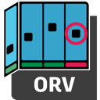

# Open RV
---
<p align="center">
  <a href="https://github.com/AcademySoftwareFoundation/OpenRV.git">
    
  </a>
</p>

---
<p align="center">
   <a href="http://www.vfxplatform.com/"></a> <a href="https://aswf-openrv.readthedocs.io/en/latest"></a>
</p>

## Overview

Open RV is an image and sequence viewer for VFX and animation artists.
Open RV is high-performant, hardware accelerated, and pipeline-friendly.

[Open RV Documentation on Read the Docs](https://aswf-openrv.readthedocs.io/en/latest/)


## Blackmagicdesign&reg; Video Output Support (Optional)

Download the Blackmagicdesign&reg; SDK to add Blackmagicdesign&reg; output capability to Open RV (optional): https://www.blackmagicdesign.com/desktopvideo_sdk<br>

Then set RV_DEPS_BMD_DECKLINK_SDK_ZIP_PATH to the path of the downloaded zip file on the rvcfg line.<br>
Example:
```bash
rvcfg -DRV_DEPS_BMD_DECKLINK_SDK_ZIP_PATH='<downloads_path>/Blackmagic_DeckLink_SDK_14.1.zip'
```

## NDI&reg; Video Output Support (Optional)

Download and install the NDI&reg; SDK to add NDI&reg; output capability to Open RV (optional): https://ndi.video/<br>
This must be done before the `configure` step.
